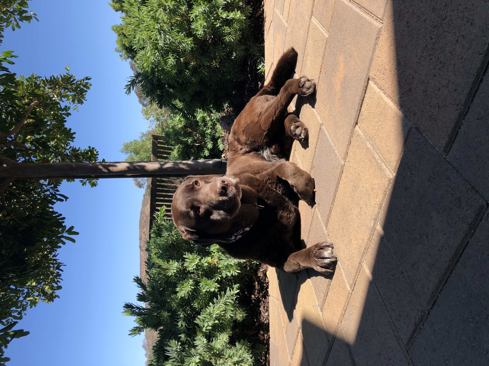
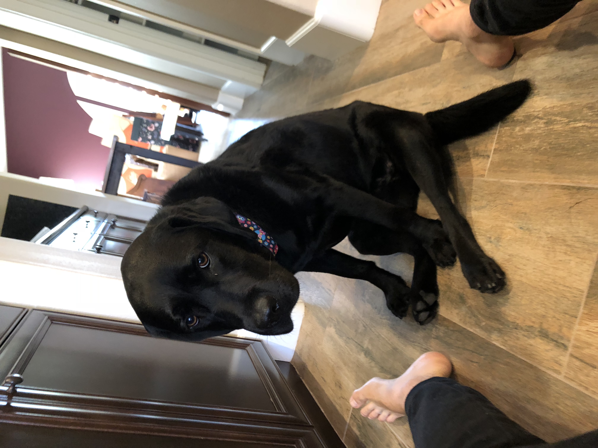

# Noah Todd's User Page

## Who I Am

Hello, I'm *Noah*. Below is a bit of a self-introduction.

### **Professional Edition** of Who I Am

I'm a third year Computer Engineering major with a minor in Chinese Studies.

I would say I lucked out picking the major I have. I took an introductory programming course in high school and really enjoyed that, but also really enjoyed the various physics courses I took as well. I took a bit of a gander on the major I chose and I couldn't be happier. It has allowed me to diversify my knowledge toolkit and let me explore different career paths.

On campus I am involved as a tutor for the Electrical Engineering Department, and as a Campus Ambassador (campus tour guide). I am currently looking to get involved in research to explore academia as a potential career path.

I know I have a lot to learn, but as of now, my favorite programming languages are:
- C#
- C++
- SQL

> Honestly, I am not too sure which niche of Computer Science I want to go into, but hey, I guess that's the point of college.

To wrap the *professional* section up, I will leave you with my favorite block of code.
```

if (!work)
{
    work = true;
}
```

### Free time me

I enjoy spending time with friends (virtually, for the time being) and my two dogs :dog: (pictures below).

Kodi   |  Kuma
:-------------------------:|:-------------------------:
|

